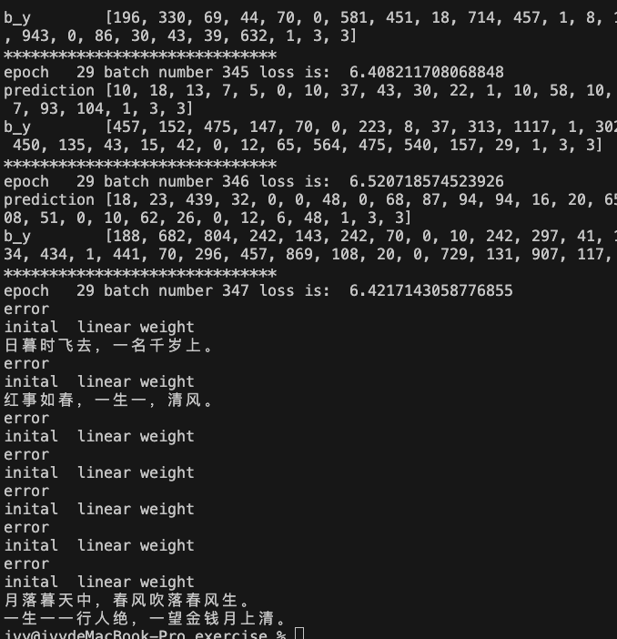
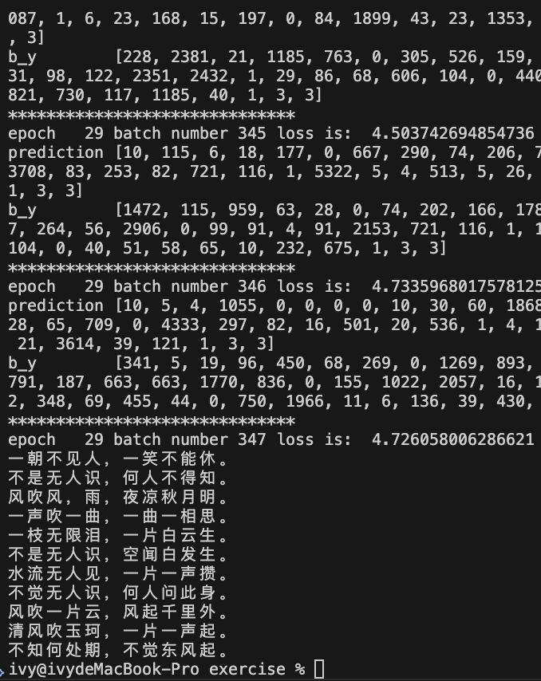

# 循环神经网络唐诗生成作业报告

## 1. 实验任务

本次作业选择 PyTorch 版本完成唐诗生成实验。根据题目要求，主要工作包括以下四部分：

1. 补全 `rnn.py` 中的关键代码，完成模型搭建。
2. 解释 RNN、LSTM、GRU 三种循环神经网络模型。
3. 叙述基于循环神经网络的诗歌生成过程。
4. 以“日、红、山、夜、湖、海、月”为起始词生成诗歌，并给出实验结果与总结。

本实验数据集为唐诗语料，模型目标是学习字与字之间的上下文依赖关系，从而根据给定开头字逐字生成诗句。

## 2. RNN、LSTM、GRU 模型说明

### 2.1 RNN

RNN 即循环神经网络，适合处理序列数据，例如文本、语音和时间序列。与普通前馈神经网络不同，RNN 在当前时刻不仅接收当前输入，还会接收上一时刻的隐藏状态，因此能够保留历史信息。

其基本思想是：

- 在时间步 $t$ 输入当前字向量 $x_t$
- 结合上一时刻隐藏状态 $h_{t-1}$
- 计算当前隐藏状态 $h_t$
- 再由 $h_t$ 预测当前时刻输出 $y_t$

RNN 的优点是结构简单，能够建模序列上下文关系；缺点是在长序列训练中容易出现梯度消失或梯度爆炸，导致长期依赖信息难以保留。

### 2.2 LSTM

LSTM 即长短期记忆网络，是 RNN 的改进结构。它通过引入记忆单元和门控机制来缓解普通 RNN 的梯度消失问题。

LSTM 主要包含三类门：

- 遗忘门：决定上一时刻的记忆保留多少。
- 输入门：决定当前输入写入多少新信息。
- 输出门：决定当前记忆对隐藏状态输出多少。

LSTM 的核心优势在于能够在更长的序列上保存信息，因此在文本生成、机器翻译、语音识别等任务中效果通常优于普通 RNN。本次实验中使用的就是 LSTM。

### 2.3 GRU

GRU 即门控循环单元，也是一种对 RNN 的改进模型。它结构比 LSTM 更简单，只保留了两个门：

- 更新门：控制旧信息保留与新信息写入的比例。
- 重置门：控制当前输入与历史信息结合的程度。

相比 LSTM，GRU 参数更少、训练速度通常更快，在一些中小规模任务上可以取得与 LSTM 接近的效果。可以认为 GRU 是在保留门控思想基础上对 LSTM 的轻量化简化版本。

### 2.4 三种模型对比

- RNN 结构最简单，但长程依赖建模能力较弱。
- LSTM 结构最复杂，但记忆能力更强，适合较长文本建模。
- GRU 结构介于两者之间，训练效率较高，实现也更简洁。

因此，在诗歌生成这类文本序列任务中，LSTM 和 GRU 一般比普通 RNN 更合适。

## 3. 诗歌生成过程

本实验的诗歌生成流程可以概括为“数据预处理 -> 字向量表示 -> LSTM 建模 -> 逐字预测 -> 拼接生成”。

### 3.1 数据预处理

原始唐诗数据保存在 `poems.txt` 中。预处理时主要做了以下几步：

1. 读取每一首诗，提取标题和正文。
2. 去除空格及不符合要求的特殊字符。
3. 过滤过短或过长的文本。
4. 在每首诗前后分别加入开始标记 `G` 和结束标记 `E`。
5. 将全部汉字统计成词表，并映射为整数编号。

经过上述处理后，每首诗都被表示成一个整数序列，便于后续送入神经网络。

### 3.2 输入与输出构造

训练时采用“当前字预测下一个字”的方式构造样本：

- 输入序列 `x = [w1, w2, w3, ..., wn]`
- 目标序列 `y = [w2, w3, w4, ..., wn, wn]`

也就是说，模型在每个时间步都学习“看到前面的字后，下一个字最可能是什么”。这本质上是一个多分类问题。

### 3.3 模型结构

本实验采用的模型结构如下：

1. `Embedding` 层：将字编号映射为稠密向量。
2. 两层 `LSTM`：建模字序列的上下文依赖关系。
3. `Linear` 全连接层：把隐藏状态映射到词表大小。
4. `LogSoftmax`：输出每个字作为下一个字的对数概率。

训练损失函数为 `NLLLoss`，优化器使用 `RMSprop`。

### 3.4 诗歌生成方法

生成时先给定一个起始字，如“日”：

1. 将起始字转换为编号输入模型。
2. 模型预测下一个字的概率分布。
3. 取概率最大的字作为下一个输出。
4. 将新生成的字继续拼接回输入序列。
5. 重复上述步骤，直到遇到结束标记 `E` 或达到最大长度。

这样模型就能从一个给定的 begin word 出发，逐字生成一首诗。

## 4. 代码补全与实现说明

本次作业选择的是 PyTorch 版本，主要补全并检查了 `chap6_RNN/tangshi_for_pytorch/rnn.py` 中的两处关键代码：

1. 定义两层 LSTM：
   `self.rnn_lstm = nn.LSTM(input_size=embedding_dim, hidden_size=lstm_hidden_dim, num_layers=2, batch_first=True)`
2. 在前向传播中初始化隐藏状态和细胞状态，并将输入送入 LSTM：
   `output, _ = self.rnn_lstm(batch_input, (h0, c0))`

此外，在调试过程中还对 `main.py` 和 `rnn.py` 做了必要修正，主要包括：

- 修复数据读取中由 `split(':')` 引起的异常打印问题。
- 去除重复的初始化提示输出。
- 调整测试阶段逻辑，避免每次生成诗句都重新加载模型。
- 修正输出层，使其与 `NLLLoss` 的使用方式一致。

这些修改的目的主要是让训练和测试过程更加稳定、结果更容易观察。

## 5. 实验结果

### 5.1 起始词生成结果/截图

利用已经保存的模型 `poem_generator_rnn`，以题目要求的七个 begin word 进行生成，tensorflow 结果（耗时 1 小时）见 notebook:

```
日暮云，一片花声，一声无人。
红蓉畔，风吹一枝花。
山畔晚来春，一片花声，一声无处。
夜暮，一声无处。
湖畔，风吹一枝。
海滨，一日无人。
月，一声无处。
```

pytorch 版见（耗时 5-6 小时）：





### 5.2 训练现象分析

1. 当前训练方式是逐首、逐样本累积损失，训练效率较低。
2. batch 处理方式较为原始，没有对变长序列做更规范的 padding 与并行计算。
3. 训练轮数、学习率、模型规模等超参数可能还未调到较优状态。
4. 生成阶段采用贪心策略，只取最大概率字，容易让输出过早结束或陷入单调结果。

因此，当前实验更适合作为 RNN/LSTM 文本生成原理的练习实现，而不是高质量诗歌生成系统。

## 6. 实验总结

通过本次实验，我完成了基于 PyTorch 的唐诗生成程序，并进一步理解了循环神经网络在序列建模任务中的基本思想。

本次实验让我有以下几点收获：

1. 理解了 RNN、LSTM、GRU 三种模型的结构差异与适用场景。
2. 掌握了文本从原始字符到整数序列、再到嵌入向量的处理流程。
3. 理解了“输入前文、预测下一个字”的语言模型训练方式。
4. 认识到文本生成效果不仅与模型结构有关，也与数据清洗、训练方式、解码策略和超参数选择密切相关。

本实验最终模型生成结果一般，说明简单 LSTM 虽然能够学习一定的字级依赖关系，但要生成更连贯、更符合格律和语义的唐诗，还需要在以下方面进一步改进：

- 使用更规范的批量训练方法提高训练效率。
- 延长训练时间并调整学习率、隐藏层维度等超参数。
- 采用随机采样、温度采样或束搜索等更合理的解码策略。
- 在数据集预处理阶段进一步清洗异常样本。

总体来看，本次作业较好地完成了从理论理解到代码实现再到实验分析的完整过程。

## 8. 参考文献

1. Xingxing Zhang and Mirella Lapata. 2014. Chinese Poetry Generation with Recurrent Neural Networks. In Proceedings of EMNLP 2014.
2. 课程提供的 `README.md` 与作业说明文件。
